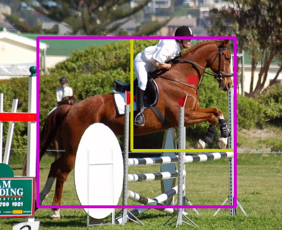
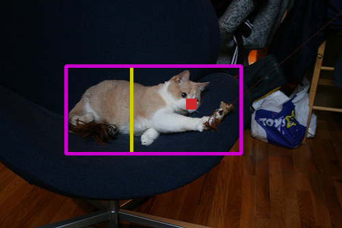
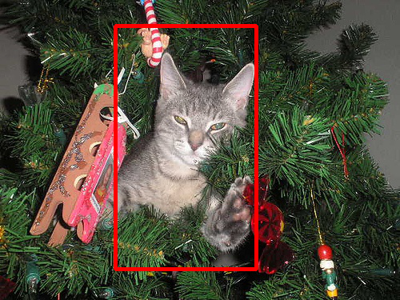

# LOST 
Pytorch implementation of the unsupervised object discovery method **LOST**. More details can be found in the paper:

**Localizing Objects with Self-Supervised Transformers and no Labels**, BMVC 2021 [[arXiv](https://arxiv.org/abs/2109.14279)]  
by *Oriane Siméoni, Gilles Puy, Huy V. Vo, Simon Roburin, Spyros Gidaris, Andrei Bursuc, Patrick Pérez, Renaud Marlet and Jean Ponce*

<div>
  
  
  
</div>  


\
If you use the **LOST** code or framework in your research, please consider citing:


```
@inproceedings{LOST,
   title = {Localizing Objects with Self-Supervised Transformers and no Labels},
   author = {Oriane Sim\'eoni and Gilles Puy and Huy V. Vo and Simon Roburin and Spyros Gidaris and Andrei Bursuc and Patrick P\'erez and Renaud Marlet and Jean Ponce},
   journal = {Proceedings of the British Machine Vision Conference (BMVC)},
   month = {November},
   year = {2021}
}
```

## Content
#### LOST
- [Installation of LOST](#installation-of-lost) 
- [Apply LOST to one image](#apply-lost-to-one-image)
- [Launching LOST on datasets](#launching-lost-on-datasets)

#### Towards unsupervised object detection
- [Installation of LOST+CAD/OD](#installation-for-cad-and-od-trainings)
- [Training LOST+CAD](#training-a-class-agnostic-detector-cad-with-lost-pseudo-annotations)
- [Training LOST+OD](#training-a-class-aware-detector-od-with-lost-pseudo-annotations)


## Installation of LOST
### Dependencies

This code was implemented with python 3.7, PyTorch 1.7.1 and CUDA 10.2. Please install [PyTorch](https://pytorch.org/). In order to install the additionnal dependencies, please launch the following command:

```
pip install -r requirements.txt
```

### Install DINO
This method is based on DINO [paper](https://arxiv.org/pdf/2104.14294.pdf). The framework can be installed using the following commands:
```
git clone https://github.com/facebookresearch/dino.git
cd dino; 
touch __init__.py
echo -e "import sys\nfrom os.path import dirname, join\nsys.path.insert(0, join(dirname(__file__), '.'))" >> __init__.py; cd ../;
```

The code was made using the commit ba9edd1 of DINO repo (please rebase if breakage).

## Apply LOST to one image
Following are scripts to apply LOST to an image defined via the `image_path` parameter and visualize the predictions (`pred`), the maps of the Figure 2 in the paper (`fms`) and the visulization of the seed expansion (`seed_expansion`). Box predictions are also stored in the output directory given by parameter `output_dir`.

```
python main_lost.py --image_path examples/VOC07_000236.jpg --visualize pred
python main_lost.py --image_path examples/VOC07_000236.jpg --visualize fms
python main_lost.py --image_path examples/VOC07_000236.jpg --visualize seed_expansion
```

## Launching LOST on datasets
Following are the different steps to reproduce the results of **LOST** presented in the paper. 

### PASCAL-VOC
Please download the PASCAL VOC07 and PASCAL VOC12 datasets ([link](http://host.robots.ox.ac.uk/pascal/VOC/)) and put the data in the folder `datasets`. There should be the two subfolders: `datasets/VOC2007` and `datasets/VOC2012`. In order to apply lost and compute corloc results (VOC07 61.9, VOC12 64.0), please launch:
```
python main_lost.py --dataset VOC07 --set trainval
python main_lost.py --dataset VOC12 --set trainval
```

### COCO
Please download the [COCO dataset](https://cocodataset.org/#home) and put the data in  `datasets/COCO`. Results are provided given the 2014 annotations following previous works. The following command line allows you to get results on the subset of 20k images of the COCO dataset (corloc 50.7), following previous litterature. To be noted that the 20k images are a subset of the `train` set.
```
python main_lost.py --dataset COCO20k --set train
```

### Different models
We have tested the method on different setups of the VIT model, corloc results are presented in the following table (more can be found in the paper). 

<table>
  <tr>
    <th>arch</th>
    <th>pre-training</th>
    <th colspan="3">dataset</th>
  </tr>
  <tr>
    <th></th>
    <th></th>
    <th>VOC07</th>
    <th>VOC12</th>
    <th>COCO20k</th>
  </tr>
  <tr>
    <td>ViT-S/16</td>
    <td>DINO</td>
    <td>61.9</td>
    <td>64.0</td>
    <td>50.7</td>
  <tr>
  <tr>
    <td>ViT-S/8</td>
    <td>DINO</td>
    <td>55.5</td>
    <td>57.0</td>
    <td>49.5</td>
  <tr>
  <tr>
    <td>ViT-B/16</td>
    <td>DINO</td>
    <td>60.1</td>
    <td>63.3</td>
    <td>50.0</td>
  <tr>
  <tr>
    <td>ResNet50</td>
    <td>DINO</td>
    <td>36.8</td>
    <td>42.7</td>
    <td>26.5</td>
  <tr>
  <tr>
    <td>ResNet50</td>
    <td>Imagenet</td>
    <td>33.5</td>
    <td>39.1</td>
    <td>25.5</td>
  <tr>
</table>

\
Previous results on the dataset `VOC07` can be obtained by launching: 
```
python main_lost.py --dataset VOC07 --set trainval #VIT-S/16
python main_lost.py --dataset VOC07 --set trainval --patch_size 8 #VIT-S/8
python main_lost.py --dataset VOC07 --set trainval --arch vit_base #VIT-B/16
python main_lost.py --dataset VOC07 --set trainval --arch resnet50 #Resnet50/DINO
python main_lost.py --dataset VOC07 --set trainval --arch resnet50_imagenet #Resnet50/imagenet
```

## Towards unsupervised object detection
In this work, we additionally use LOST predictions to train object detection models without any human supervision. We explore two scenarios: class-agnostic (CAD) and (pseudo) class-aware training of object detectors (OD). The next section present the different steps to reproduce our results.

### Installation for CAD and OD trainings
We use the [detectron2](https://github.com/facebookresearch/detectron2) framework to train a Faster R-CNN model with LOST predictions as pseudo-gt. The code was developped with the version [v0.5](https://github.com/facebookresearch/detectron2/releases) of the framework. In order to reproduce our results, please install detectron2 using the next commands. In case of failure, you can find the installation corresponding to your version of pytorch/CUDA [here](https://github.com/facebookresearch/detectron2/releases).
```bash
git clone https://github.com/facebookresearch/detectron2.git
python -m pip install detectron2==0.5
```

Set global variables for ease of usage. 
```bash
export LOST=$(pwd)
cd detectron2; export D2=$(pwd);
```

Then please copy LOST-specific files to detectron2 framework, following:
```bash
ln -s $LOST/tools/*.py $D2/tools/. # Move LOST tools to D2
mkdir $D2/configs/LOST
ln -s $LOST/tools/configs/* $D2/configs/LOST/. # Move LOST configs to D2
```

### Training a Class-Agnostic Detector (CAD) with LOST pseudo-annotations

Before launching a training, data must be formated to fit detectron2 and COCO styles. Following are the command lines to do this formatting for boxes predicted with LOST.
```bash
cd $D2; 

# Format DINO weights to fit detectron2
wget https://dl.fbaipublicfiles.com/dino/dino_resnet50_pretrain/dino_resnet50_pretrain.pth -P ./data # Download the model from DINO
python tools/convert_pretrained_to_detectron_format.py --input ./data/dino_resnet50_pretrain.pth --output ./data/dino_RN50_pretrain_d2_format.pkl

# Format pseudo-boxes data to fit detectron2
python tools/prepare_voc_LOST_CAD_pseudo_boxes_in_detectron2_format.py --year 2007 --pboxes $LOST/data/LOST_predictions/LOST_VOC07.pkl

# Format VOC data to fit COCO style
python tools/prepare_voc_data_in_coco_style.py --is_CAD --voc07_dir $LOST/datasets/VOC2007 --voc12_dir $LOST/datasets/VOC2012
```

The next command line allows you to launch a CAD training with 4 gpus on the VOC2007 dataset. The batch size is set to 16, 4 to 8 GPUs may be needed depending on your machines. Please make sure to change the argument value `MODEL.WEIGHTS` to the correct path of DINO weights.
```bash
python tools/train_net_for_LOST_CAD.py --num-gpus 4 --config-file ./configs/LOST/RN50_DINO_FRCNN_VOC07_CAD.yaml DATALOADER.NUM_WORKERS 8 OUTPUT_DIR ./outputs/RN50_DINO_FRCNN_VOC07_CAD MODEL.WEIGHTS ./data/dino_RN50_pretrain_d2_format.pkl
```

Inference results of the model will be stored in `$OUTPUT_DIR/inference`. In order to produce results on the `train+val` dataset, please use the following command:
```
python tools/train_net_for_LOST_CAD.py --resume --eval-only --num-gpus 4 --config-file ./configs/LOST/RN50_DINO_FRCNN_VOC07_CAD.yaml DATALOADER.NUM_WORKERS 6 MODEL.WEIGHTS ./outputs/RN50_DINO_FRCNN_VOC07_CAD/model_final.pth OUTPUT_DIR ./outputs/RN50_DINO_FRCNN_VOC07_CAD/ DATASETS.TEST '("voc_2007_trainval_CAD_coco_style", )'
cd $LOST;
python main_corloc_evaluation.py --dataset VOC07 --set trainval --type_pred detectron --pred_file $D2/outputs/RN50_DINO_FRCNN_VOC07_CAD/inference/coco_instances_results.json
```

#### Training LOST+CAD on COCO20k dataset
Following are the command lines allowing to train a detector in a class-agnostic fashion on the COCO20k subset of COCO dataset.

```bash
cd $D2;

# Format pseudo-boxes data to fit detectron2
python tools/prepare_coco_LOST_CAD_pseudo_boxes_in_detectron2_format.py --pboxes $LOST/outputs/COCO20k_train/LOST-vit_small16_k/preds.pkl

# Generate COCO20k CAD gt annotations
python tools/prepare_coco_CAD_gt.py --coco_dir $LOST/datasets/COCO

# Train detector (evaluation done on COCO20k CAD training set)
python tools/train_net_for_LOST_CAD.py --num-gpus 4 --config-file ./configs/LOST/RN50_DINO_FRCNN_COCO20k_CAD.yaml DATALOADER.NUM_WORKERS 8 OUTPUT_DIR ./outputs/RN50_DINO_FRCNN_COCO20k_CAD MODEL.WEIGHTS ./data/dino_RN50_pretrain_d2_format.pkl

# Corloc evaluation
python main_corloc_evaluation.py --dataset COCO20k --type_pred detectron --pred_file $D2/outputs/RN50_DINO_FRCNN_COCO20k_CAD/inference/coco_instances_results.json
```


#### Evaluating LOST+CAD (corloc results)

We have provided predictions of a class-agnostic Faster R-CNN model trained using LOST boxes as pseudo-gt; they are stored in the folder `data/CAD_predictions`. In order to launch the corloc evaluation, please launch the following scripts. It is to be noted that in this evaluation, only the box with the highest confidence score is considered per image. 

```bash
python main_corloc_evaluation.py --dataset VOC07 --set trainval --type_pred detectron --pred_file data/CAD_predictions/LOST_plus_CAD_VOC07.json
python main_corloc_evaluation.py --dataset VOC12 --set trainval --type_pred detectron --pred_file data/CAD_predictions/LOST_plus_CAD_VOC12.json
python main_corloc_evaluation.py --dataset COCO20k --set train --type_pred detectron --pred_file data/CAD_predictions/LOST_plus_CAD_COCO20k.json
```

The following table presents the obtained corloc results.

<table>
  <tr>
    <th>method</th>
    <th colspan="3">dataset</th>
  </tr>
  <tr>
    <th></th>
    <th>VOC07</th>
    <th>VOC12</th>
    <th>COCO20k</th>
  </tr>
  <tr>
    <td>LOST</td>
    <td>61.9</td>
    <td>64.0</td>
    <td>50.7</td>
  <tr>
  <tr>
    <td>LOST+CAD</td>
    <td>65.7</td>
    <td>70.4</td>
    <td>57.5</td>
  <tr>
</table>

### Training a Class-Aware Detector (OD) with LOST pseudo-annotations

Following are the different steps to train a class-aware detector using LOST peusdo-boxes for the dataset VOC07. We provide LOST boxes correspoding to the dataset VOC07 in `$LOST/data/LOST_predictions/LOST_VOC07.pkl`.

```bash
cd $LOST;
# Cluster features of LOST boxes
python cluster_for_OD.py --pred_file $LOST/data/LOST_predictions/LOST_VOC07.pkl --nb_clusters 20 --dataset VOC07 --set trainval

cd $D2;
# Format DINO weights to fit detectron2
wget https://dl.fbaipublicfiles.com/dino/dino_resnet50_pretrain/dino_resnet50_pretrain.pth -P ./data # Download the model from DINO
python tools/convert_pretrained_to_detectron_format.py --input ./data/dino_resnet50_pretrain.pth --output ./data/dino_RN50_pretrain_d2_format.pkl

# Prepare the clustered LOST pseudo-box data for training
python tools/prepare_voc_LOST_OD_pseudo_boxes_in_detectron2_format.py --year 2007 --pboxes $LOST/data/LOST_predictions/LOST_VOC07_clustered_20clu.pkl

# Format VOC data to fit COCO style
python tools/prepare_voc_data_in_coco_style.py --voc07_dir  $LOST/datasets/VOC2007 --voc12_dir $LOST/datasets/VOC2012

# Train the detector on VOC2007 trainval set -- please be aware that no hungarian matching is used during training, so validation restuls are not meaningful (will be close to 0). Please use command bellow in order to evaluate results correctly. 
python tools/train_net_for_LOST_OD.py --num-gpus 8 --config-file ./configs/LOST/RN50_DINO_FRCNN_VOC07_OD.yaml DATALOADER.NUM_WORKERS 8 OUTPUT_DIR ./outputs/RN50_DINO_FRCNN_VOC07_OD MODEL.WEIGHTS ./data/dino_RN50_pretrain_d2_format.pkl

# Evaluate the detector results using hungarian matching -- allows to reproduce results from the paper
cd $LOST;
python tools/evaluate_unsupervised_detection_voc.py --results ./detectron2/outputs/RN50_DINO_FRCNN_VOC07_OD/inference/coco_instances_results.json
```

### Training details

We use the `R50-C4` model of Detectron2 with ResNet50 pre-trained with DINO self-supervision [model](https://dl.fbaipublicfiles.com/dino/dino_resnet50_pretrain/dino_resnet50_pretrain.pth). 

Details: 
- mini-batches of size 16 across 8 GPUs using SyncBatchNorm 
- extra BatchNorm layer for the RoI head after conv5, i.e., `Res5ROIHeadsExtraNorm` layer in Detectron2
- frozen first two convolutional blocks of ResNet-50, i.e., `conv1` and `conv2` in Detectron2.
- learning rate is first warmed-up for 100 steps to 0.02 and then reduced by a factor of 10 after 18K and 22K training steps 
- we use in total 24K training steps for all the experiments, except when training class-agnostic detectors on
the pseudo-boxes of the VOC07 trainval set, in which case we use 10K steps. 

## License
LOST is released under the [Apache 2.0 license](./LICENSE).
